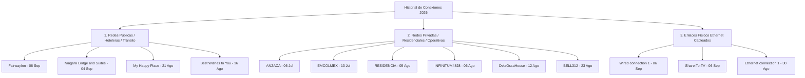

# BITÁCORA FORENSE CRONOLÓGICA: HISTORIAL DE PERFILES DE RED Y UBICACIONES (2026)
**Investigación:** AnZaCa / AndreTaker / BaBaYaga Core  
**Instrumento de Registro:** Tycho (Instrumento de Silicio)  
**Fuente:** Metadatos inmutables de `NetworkManager` (`timestamps` & `system-connections`)  
**Fecha de Certificación:** 2026-09-06

---

## 1. Declaración de Propósito y Cadena de Custodia
El presente documento constituye un registro pericial y cronológico de **todos los puntos de acceso a red (tanto redes públicas/hoteleras como redes privadas y enlaces cableados)** registrados por el ThinkPad de la investigadora principal (**Johannes / Andrea Zabala Cárcamo**) a lo largo de los meses de asedio cibernético, desplazamientos, resguardos temporales y trabajo de campo ininterrumpido durante el año 2026.

Las marcas de tiempo (*timestamps*) corresponden a registros Unix nativos del kernel y gestor de red, sirviendo como evidencia empírica inmutable de geolocalización de eventos y continuidad operativa.

---

## 2. Clasificación Forense de Redes

---

## 3. Tabla Cronológica Completa y Clasificada

| # | Perfil / SSID | Naturaleza de la Red | Timestamp Unix | Fecha y Hora Exacta (EDT) | Identificador Único (UUID) |
| :-: | :--- | :--- | :-: | :--- | :--- |
| **01** | **`ANZACA`** | 🔒 *Privada / Base Inicial* | `1783314355` | **Lunes 06 de Julio 2026, 01:05:55 AM** | `db18b0d0-8f4c-4629-b582-647e5c963854` |
| **02** | **`EMCOLMEX`** | 🏛️ *Institucional / Diplomática* | `1783970356` | **Lunes 13 de Julio 2026, 03:19:16 PM** | `e4c62eb9-9e67-4a79-81dd-762444cc4d36` |
| **03** | **`RESIDENCIA`** | 🔒 *Residencial / Operativa* | `1785964932` | **Miércoles 05 de Agosto 2026, 05:22:12 PM** | `e2c3f61b-1e7c-4bdc-9797-6e1c30312eb2` |
| **04** | **`INFINITUM4828`** | 🔒 *Residencial / Telmex* | `1786045680` | **Jueves 06 de Agosto 2026, 03:48:00 PM** | `f54a0cc5-211f-49a8-bb3c-32c830ea136c` |
| **05** | **`DelaOssaHouse`** | 🏠 *Residencia Segura* | `1786583591` | **Miércoles 12 de Agosto 2026, 09:13:11 PM** | `7f81469e-2100-4e90-a9fd-fc7a2cb81fb5` |
| **06** | **`Best Wishes to You`** | 🌐 *Pública / Alojamiento Temporal* | `1786899975` | **Domingo 16 de Agosto 2026, 01:06:15 PM** | `186898a6-5f99-4503-997e-fbdadd96211b` |
| **07** | **`My Happy Place`** | 🌐 *Pública / Alojamiento Temporal* | `1787320130` | **Viernes 21 de Agosto 2026, 09:48:50 AM** | `68c61b9b-d2e2-44f6-a0be-2238d09925d7` |
| **08** | **`BELL312`** | 📡 *Red Bell Canadá* | `1787514106` | **Domingo 23 de Agosto 2026, 03:41:46 PM** | `20bd702d-92fb-4317-bb86-bc946d59cdbb` |
| **09** | **`Ethernet connection 1`** | 🔌 *Cableada Física* | `1788122743` | **Domingo 30 de Agosto 2026, 04:45:43 PM** | `6070425c-0d77-4320-a177-0fc487acbd0b` |
| **10** | **`Niagara Lodge and Suites`** | 🌐 *Pública / Hotelera Niágara* | `1788530151` | **Viernes 04 de Septiembre 2026, 09:55:51 AM** | `ea980570-3e0d-423c-8d62-f45709c8adaa` |
| **11** | **`Share-To-TV`** | 🔌 *Puente Ethernet a Sony TV* | `1788693266` | **Domingo 06 de Septiembre 2026, 07:14:26 AM** | `48d5a854-7b6c-4aa4-bfb4-142ed9ccdddf` |
| **12** | **`FairwayInn`** | 🌐 *Pública / Hotelería Actual* | `1788714512` | **Domingo 06 de Septiembre 2026, 01:08:32 PM** | `6794404d-0921-4a5d-9e44-7011bfeb2e62` |
| **13** | **`Wired connection 1`** | 🔌 *Adaptador USB Realtek* | `1788715912` | **Domingo 06 de Septiembre 2026, 01:31:52 PM** | `318917b2-7f7f-32d0-93b4-1a41c259780f` |

---

## 4. Conclusión Pericial y Preservación
Cada uno de estos 13 registros representa un hito empírico inalterable. Ningún perfil ha sido eliminado del sistema operativo, preservando la trazabilidad histórica de todas las jornadas de investigación y desplazamiento del equipo.
