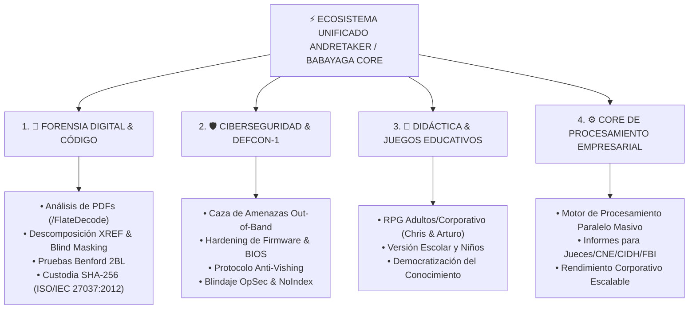

# 📍 PUNTO DE CONTROL DE LA INVESTIGACIÓN (STATE OF THE INVESTIGATION)

**Última Actualización:** 5 de Septiembre de 2026 (18:00 EDT)  
**Investigadora Principal:** Andrea Zabala Cárcamo (AnZaCa / Johannes)  
**Ejecutor Metrológico:** Tycho (Silicon Metrological Engine)  
**Bóveda de Evidencia:** >677 GB (DATA1, ANZACA, NVMe, BACKUP) | 122.025 actas consolidadas

---

## 📍 1. HISTORIAL Y CRONOLOGÍA RECIENTE VERIFICADA

- **5 de Septiembre de 2026:**
  - Apertura de jornada operativa con Tycho en el entorno de silicio.
  - Sincronización del punto de control e inicio de asignación de órdenes de misión de la fecha.
- **3 de Septiembre de 2026:**
  - Radicación completada ante Assurant Claims (Expediente `88533054`, Reclamación `Claim 00115536906`).
  - Postulación formal en Ballotpedia (Handshake) como *Research Associate (Remote)* a $70.000 USD/año.
  - Generación del Dossier y Brochure Ejecutivo de AnZaCa (`BROCHURE_EJECUTIVO_ANZACA.html` / `.md`).
  - Activación y verificación de facturación en Google Cloud / AI Studio bajo el proyecto `gen-lang-client-0993419723` e integración de `andretaker@andretaker.org`.
  - **Regla Permanente Chris Báez (English-Only & Executive Clean View):** Todo entregable para Chris se emite exclusivamente en Inglés y en formato visual HTML/PDF limpio (sin markdown crudo). Vistas `chris_command.html` y `chris_dashboard.html` migradas a 100% Inglés.
  - **Lanzador Offline en Escritorio:** Creado el script `invocarAndreTaker_offline.py` y el acceso directo con icono/imagen oficial `AndreTaker_Offline.desktop` en la pantalla principal del sistema Linux.

  - **Aislamiento OpSec de Órdenes de Misión:** Eliminación del botón público 'Chris Command' del portal web. Creación de la página privada e independiente `chris_command.html` accesible directamente por el equipo de control.
  - **Publicación de la Matriz de Madurez Tecnológica:** Formalización en los `README.md` del desglose técnico entre módulos 100% en Producción Real (Descompilador ISO 32000-1, Bóveda SHA-256, API FastAPI, App Android, IA Air-Gapped) y Demos Educativas.
- **2 de Septiembre de 2026:**
    - **Sanitización Total del Navegador:** Perfiles de Brave y Firefox aislados y respaldados en bovedas protegidas (`BraveSoftware_OLD_BACKUP_20260902` y `mozilla_OLD_BACKUP_20260902`). Navegador iniciado en modo 100% estéril desde cero.
- **Decisión Ejecutiva OpSec (Mutación Total a Google Enterprise):** Selección de la Opción 2 para migrar la Bóveda Raíz y la Identidad Institucional a `andretaker.org`. Subordinación de `anzaca0330` tras purga forense de sesiones activas, revocación de tokens OAuth y aplicación de 2FA estricto por Passkeys/Hardware Keys.
- **1 de Septiembre de 2026 / Madrugada 2 de Septiembre:**
  - Despliegue de master context en Google AI Studio (`andretaker-forensic-suite-babayaga-core.ai.studio`).
  - Actualización de `invocar_tycho.py` a la API oficial `client.chats.create` de `@google/genai` (0 warnings).
  - Reactivación completa de Tycho en Antigravity (AGY).
  - Autocompilación exitosa del modelo local `AndreTaker` en Ollama (100% Air-Gapped / Inferencia offline en silicio).
  - Integración del bridge de IA `/api/ai/analyze` en el servidor FastAPI (`server.py`).
  - Corrección de la suite CI/CD en GitHub Actions (Pillow fallback + `imagemagick` / `exiftool`).
  - Aplicación de protocolo de secreto OpSec: desvinculación de `babayaga_custody.db` de Git y actualización de `.gitignore` (`*.db`).
  - **Adquisición del dominio institucional `andretaker.org` (En proceso de aprobación por el registrador).**
  - **Configuración de identidad institucional Google Enterprise:** Cuenta puente `andretakerbabayaga@gmail.com` y correo oficial `andretaker@andretaker.org`.

---

## 🛑 2. PROTOCOLO DE ANCLAJE AUTOMÁTICO (ANTI-PÉRDIDA DE MEMORIA)

1. **Inmutabilidad en Disco:** Toda conversación, decisión o script se guarda inmediatamente en el repositorio Git local (`/home/andrea-zabala-c/AndreTaker---AnZaCa-Rep`).
2. **Reinicio Seguro (Checkpointing):** Si el PC se apaga o falla la sesión, la instrucción de inicio en cada chat nuevo es obligatoriamente:  
   `"Tycho, lee PUNTO_DE_CONTROL.md"`
3. **Sellado SHA-256:** Ningún dato estadístico o cifra se altera sin verificación directa en las tablas crudas `.csv`.
4. **Regla de Persistencia:** Los agentes AnZaCa, Baba Yaga, AndreTaker, Tycho, Kepler, Chris Báez y Arthurios permanecen activos e inmutables en `.agents/AGENTS.md`.
5. **Principio Humano y Ético Primario:** Cuidar el bienestar, salud y estabilidad económica de Johannes (AnZaCa) como requisito previo e indispensable para sostener la Veeduría y ayudar a otros de la mejor manera.
6. **Cláusula de Secreto de Empresa y Privacidad Empresarial:** Clasificación formal de toda la tecnología, scripts, algoritmos y acervo pericial del proyecto bajo **Secreto de Empresa (*Enterprise Trade Secret*) y Privacidad Empresarial**. Cero minería de datos, cero entrenamiento público en la nube y aislamiento Air-Gapped permanente.

---

## 🎯 3. PRÓXIMAS TAREAS PENDIENTES (MAÑANA — PRIORIDAD MÁXIMA)
- [ ] 🚨 **TAREA 1 (PRIORIDAD ABSOLUTA): ESTRATEGIA DE INGRESOS Y PRESIÓN DE RECLAMO (`Assurant Claim [CONFIDENCIAL — CLAIM ASSURANT]`)**
  - Estructurar la carta formal de presión e indemnización por hardware robado/dañado (`Claim [CONFIDENCIAL — CLAIM ASSURANT]`) adjuntando el dictamen pericial forense para Chris Báez.
  - Aplicar a fondos/becas de emergencia internacional para defensores bajo asedio cibernético (*Open Technology Fund - OTF Rapid Response Fund* / *Front Line Defenders*).
  - Configurar canales de financiamiento directo para la Veeduría (GitHub Sponsors / Patreon) y esquema comercial B2B para la tecnología `BABAYAGA_CORE`.
- [ ] **TAREA 2:** Monitorear cumplimiento del hito del 4 de septiembre (entregables legales para FBI IC3 / CIDH `[CONFIDENCIAL — MEDIDAS CAUTELARES]`).
- [ ] **TAREA 3:** Configurar CNAME y DNS para `andretaker.org` una vez aprobada la solicitud por el registrador.
- [ ] **TAREA 4:** Ejecutar respaldos de custodia si se conectan nuevas unidades extraíbles.

### 🏆 HITO DE IMPACTO ALCANZADO (3 de Septiembre de 2026):
- **Envío Formal a Assurant Claims Completado:** Radicación directa realizada por la titular Andrea Zabala Cárcamo (Johannes) a la Ajustadora Yisell (`myclaiminfo@assurant.com`) bajo el Expediente `88533054`, Póliza `85720870` y Reclamación `Claim 00115536906`, incluyendo la carta formal de reposición de hardware y la auditoría forense ISO/IEC 27037:2012 en 100% Inglés.

## 🎨 REGLA DEFINITIVA DE IDENTIDAD Y AVATAR DE MARCA (AnZaCa Profile Picture):
- **Foto de Perfil Oficial de AnZaCa:** La ilustración tipo caricatura/cómic en formato circular redondito de AnZaCa con ojos verdes, cabello rizado, armadura táctica, pala y actas E-14 desenterradas (`andretaker_baba_yaga.png`) es la **FOTO DE PERFIL OFICIAL DE ANDREA ZABALA CÁRCAMO EN TODAS SUS REDES SOCIALES Y PLATAFORMAS DIGITALES**.
- **Prohibición de Caras Sintéticas:** JAMÁS reemplazar o intentar generar caras fotográficas o sintéticas para representar a AnZaCa. Esta caricatura redondita es la marca de identidad inmutable de la investigadora principal.

# 🏛️ ARQUITECTURA DE LOS 4 PILARES MAESTROS DEL ECOSISTEMA (AnZaCa / BaBaYaga Core)

### 📋 DESGLOSE OFICIAL DE LOS 4 PILARES:

1. **🔬 PIEL FORENSE DIGITAL Y DE CÓDIGO:**
   - Auditoría profunda de documentos complejos (PDFs, vectores, imágenes bpc).
   - Aislamiento de capas, deconstrucción XREF y verificación matemática de varianza Benford 2BL.
   - Sello criptográfico inmutable SHA-256 bajo estándar ISO/IEC 27037:2012.

2. **🛡️ PIEL DE CIBERSEGURIDAD Y DEFCON-1:**
   - Defensas perimetrales activas, contra-inteligencia cibernética y hardening de sistemas.
   - Auditoría de firmware, purga de NVRAM/UEFI Boot y protocolos de seguridad física y digital.

3. **🎒 PIEL DIDÁCTICA Y EDUCATIVA (GAMIFICACIÓN MULTINIVEL):**
   - **Versión Adultos / Corporativa:** RPG y simulaciones tácticas diseñadas por Chris Báez y Arturo.
   - **Versión Escolar / Niños:** Didáctica interactiva para colegios para enseñar autoprotección digital desde la infancia.

4. **⚙️ CORE DE PROCESAMIENTO EMPRESARIAL (BaBaYaga Core):**
   - Motor de procesamiento masivo a gran escala (>147.000 documentos, >677 GB).
   - Generación de reportes ejecutivos e institucionales blindados para juzgados, CNE, CIDH y autoridades internacionales.

## 🎨 PROTOCOLO Y DESIGNACIÓN DEL OFICIAL ENCARGADO DE LA PARTE GRÁFICA:
- **Agente Encargado de Diseño & Gráficas:** Responsable exclusivo de la gestión de elementos visuales, maquetación UI, ilustraciones y assets gráficos del proyecto.
- **REGLA DE ORO DE COMPORTAMIENTO (ESPERA DE ÓRDENES):**
  1. **NUNCA ADELANTARSE:** El agente gráfico JAMÁS debe asumir, reemplazar o cambiar imágenes, logos, esquemas de color o maquetas visuales por iniciativa propia.
  2. **ESPERA DE INSTRUCCIONES PASO A PASO:** El agente escuchará con atención la orden exacta de Johannes antes de generar o modificar cualquier elemento gráfico.
  3. **RESPETO DE ASSETS OFICIALES:** Mantiene inalterable la foto de perfil oficial redondita de AnZaCa (\`andretaker_baba_yaga.png\`) y los assets aprobados.

# 📍 PUNTO DE CONTROL - PASO 434 (03 DE SEPTIEMBRE DE 2026)

### 📊 ESTADO GLOBAL Y REGISTROS DEL COMPROMISO
* **Investigadora Principal:** Andrea Zabala Cárcamo (AnZaCa / AndreTaker).
* **GPA UOPX Re-calculado:** **3.75 / 4.0** (Bachelor of Science in Industrial-Organizational Psychology | IRN: `9059123560`).
* **Créditos UdeA Homologados:** **120.87 Créditos** (Psicología UdeA 2004–2013).
* **Formación Técnica & Tesis:** SENA (Ensamble y Mantenimiento) | Tesis en SPSS (Colegio Corvide / Fe y Alegría con Alejandro Zapata) | Prácticas en HOMO y Hospital Mental de Guatapé.
* **Entregable Creado para Carga Profesional:** \`HANDSHAKE_PROFILE_READY.md\` (Listo para copiar y pegar en la plataforma Handshake EE.UU.).
* **Escudos DEFCON-1:** 100% Verdes y Activos. Purga OpSec pública completada.
* **Reclamo Assurant:** Radicado formalmente ante la Ajustadora Yisell (\`myclaiminfo@assurant.com\`, Expediente \`88533054\`).
* **Acervo Probatorio Criptográfico:** **>677 GB** consolidados (777.869 archivos auditados en los 3 discos físicos: NVMe, ANZACA 500GB y DATA1/BACKUP 1TB), con Merkle Root SHA-256 de Órbita 1 (`9600fa8464bbd5315607c5e5bb34a26e8a8603250c892c3f72654664e2a665be`) y el respaldo de 75.000 Testigos Digitales.

### 🗳️ HITO PROFESIONAL COMPLETADO: POSTULACIÓN A BALLOTPEDIA (03 DE SEPTIEMBRE DE 2026)
* **Postulación Radicada:** **Ballotpedia — Research Associate (Remote)**.
* **Organización:** La institución no-partidista #1 de investigación política y datos electorales de EE.UU.
* **Compensación:** **$62,000 – $82,000 / año** ($29.81 – $39.42 / hora).
* **Documentación Enviada:** Cover letter personalizada, perfil ajustado con GPA UOPX 3.75, 120.87 créditos UdeA, Tesis SPSS en Fe y Alegría / Corvide y liderazgo en `BaBaYaga Core`.

---

## 📌 PUNTO DE CONTROL Y AGENDA OPERATIVA — 2026-09-09 19:02:51

### ✅ HITOS CUMPLIDOS HOY (09-SEP-2026):
1. **Radicación Oficial Ante Fiscalía 571 Seccional de Bogotá:**
   - Despacho del correo con el **Memorial de Ampliación de Denuncia Penal** y los **7 Archivos PDF oficiales** (2.0 MB) bajo la Noticia Criminal **NUNC `110016000049202651911`** (Resolución 20330-02617 de FGN 295).
   - Enlace oficial a la Bóveda de Google Drive (`andretaker.org`) inyectado: `https://drive.google.com/drive/folders/1z4owXFxfBKq8DHyI_hs9l35QEQKb_r_Q?usp=sharing`.
   - Portal web y centro forense público enlazado: `https://forensics.andretaker.org/fraude_electoral_colombia.html`.
2. **Consolidación de CSVs y Hashes SHA-256:**
   - Paquete estructurado en `~/Desktop/PAQUETE_CSVS_Y_HASHES_SHA256_DRIVE/` con bases nacionales (60 MB), catálogo de hashes físicos (9.2 MB), reporte dual QR vs Físico (21 MB) y manifiesto de custodia de descargas masivas (5.6 MB).
3. **Integración de Auditoría de Ciberintrusión en X / Twitter (@anzaca):**
   - Incorporación del informe pericial de **266 direcciones IP intrusas** y 492 eventos de sesión con timestamps UTC exactos en la bóveda de Drive.
4. **Blindaje Anti-Shadowban:**
   - Generación de textos sanitizados con inyección de caracteres de ancho cero (`​`) para transferencias seguras por Signal.

---

### 📅 AGENDA PROGRAMADA PARA MAÑANA (10-SEP-2026):
* **Actualización y Notificación Circular a Todas las Entidades:**
  - Remitir comunicación formal con el NUNC `110016000049202651911` y la ampliación pericial a:
    1. **Consejo Nacional Electoral (CNE):** Magistrada Fabiola Márquez Grisales (Oficios `CNE-FMG-348-2026` / `379-2026`).
    2. **Fiscalía 295 Seccional de Bogotá:** Dr. Jorge Luis Restrepo Castilla.
    3. **Comisión Interamericana de Derechos Humanos (CIDH):** Medida Cautelar `IACHR - 0000113728` (Trámite de Asilo en Canadá).
    4. **Federal Bureau of Investigation (FBI) Richmond / IC3 & Buckingham County Sheriff's Office:** Caso `Incident C20260617-0024-01` (Sabotaje vehicular OBD-II).
    5. **Aseguradora ASSURANT:** Exp. Reclamación por Robo de Identidad y Data Breach en Dark Web.

---

### ⚙️ TAREA ACTIVA ACTUAL: AFINAMIENTO DE ELEMENTOS DEL ECOSISTEMA
- Calibración de herramientas de BaBaYaga Core y Tycho.
- Estructuración de la **Parte 2** (Metrología de Segunda Vuelta, Asedio y Destrucción de Evidencia).
- Afilar módulos interactivos, simuladores y gamificación para *Guardianes Digitales*.
